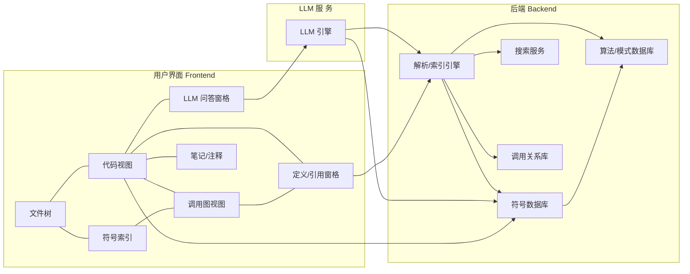

# 执行摘要

当前大多数开发者将大量时间花在理解已有代码上。现有工具（如 Source Insight、OpenGrok 等）提供调用图、符号索引和跨文件搜索功能，但主要面向专业工程师。本项目“Code Archmage”定位于**面向初级大学生**的源码剖析工具，聚焦阅读理解而非代码编辑或运行。它将借鉴上述工具的导航与搜索能力，并结合内置 LLM 问答，帮助新手快速定位关键算法、变量与接口逻辑。总体目标是打造一个小而精的产品，核心功能集中于“拆解源码”本身。

## 产品定位与目标用户画像

- **目标用户**：年龄**18–25岁**的计算机相关专业本科生或刚毕业大学生（未指定具体专业）。他们具备基础编程与算法能力，曾做过一些算法题目，但缺乏大型项目经验，对成千上万行含多层封装的工程代码感到畏惧。  
- **背景/技能假设**：了解编程语言基本语法、数据结构和算法原理；使用过 Git 等版本控制工具；使用过 VSCode 等 IDE 进行小型项目开发。尚未熟悉大型代码库的模块化架构、复杂接口和边界检测。  
- **使用场景**：学生在课程项目、实习或开源项目中需要快速理解陌生代码。希望通过直观的导航和注释解释来了解代码功能和结构。需要一个类比“Source Insight”这样的工具，帮助他们“拆解”陌生代码并提供交互式辅助解释。

## 能力边界（要做/不做清单）

- **要做（Do）**：  
  - **代码静态阅读与导航**：显示文件树、源代码视图、符号/变量列表，支持跳转到定义、引用等操作。  
  - **全文与符号搜索**：提供类似 IDE 的搜索功能，支持关键字、正则、符号名搜索，在整个工程中快速定位代码段。  
  - **函数调用与类继承关系可视化**：展示函数/方法调用图、类继承图等，帮助理解代码结构。  
  - **交互式注释与 LLM 问答**：内置语言模型（LLM）问答功能，允许用户针对某段代码或功能提出问题并获得解释。  
  - **代码片段摘要与高亮**：自动生成函数或模块摘要，标注关键算法和代码路径。  
  - **跨文件/模块追踪**：在多文件工程中跟踪变量、函数流向和依赖关系。  
  - **会话记录和笔记**：用户可以保存学习笔记或重要代码片段注释，方便后续复习。

- **不做（Not To Do）**：  
  - **不作为代码编辑器**：不支持源代码的编写、运行、调试。无法执行代码或提供运行时结果。  
  - **不专注于代码生成**：不包含自动补全、重构或自动生成代码功能（仅关注阅读、理解）。  
  - **不承担大型工程CI/CD**：不负责代码测试、持续集成、部署等任务，仅限代码阅读层面。  
  - **不处理多语言混合**：MVP阶段可优先支持常见语言（如C/C++/Java/Python），其他语言可标记“未指定”。  
  - **不涉及团队协作功能**：初期不考虑多人协同编辑或注释共享，重点放个人学习使用。  
  - **不替代详细文档**：虽能生成代码摘要，但不能保证完全准确，用户仍需自行验证（避免误导）。  

## 可行产品形态对比

| 形式             | 优点                                             | 缺点                                            | 适配场景                   | 技术实现要点                                    | GUI 功能清单（核心/可选）             |
|------------------|--------------------------------------------------|-------------------------------------------------|----------------------------|-----------------------------------------------|-------------------------------------|
| **VSCode/IDE 插件**  | - 与熟悉环境无缝整合 - 利用 IDE 原有功能 - 可接入语言服务器    | - 需要安装配置 IDE 环境 - 插件开发与维护复杂 - IDE 资源消耗高  | 适合已有 VSCode 等 IDE 经验的学生 愿意在熟悉环境中使用 | - 基于 VSCode Extension API - 使用语言服务器(LS)或 Universal Ctags 获取符号信息 - 前端用 TypeScript/HTML | - 文件资源管理器（浏览工程） **** - 代码视图与跳转 **** - 符号面板（函数/变量列表） **** - 定义/引用查询 **** - 调用图/类图 **** - 内置 LLM 问答面板 **** - 会话笔记/注释 **** |
| **静态只读笔记本/代码浏览器** | - 无需运行环境，只读 HTML/Markdown 页面 - 简单部署，无需动态后端 - 适合制作文档和教程       | - 交互性弱，实时分析能力有限 - 无法响应用户查询或 LLM 对话 - 功能受限       | 适合快速生成项目概览或教程文档 适用于网络课堂或文档发布 | - 使用静态站点生成工具 (如 MkDocs, Gatsby) - 语法高亮 (如 PrismJS) - 构建搜索索引 (如 Lunr.js)  | - 项目结构树 **** - 源码展示（高亮） **** - 静态的调用关系图 **** - 链接注释/文档 **** - 简易全文搜索（前端索引） **** |
| **独立 Web 应用**     | - 跨平台，无需安装客户端 - 可集成丰富交互（图、聊天窗口） - 容易部署最新模型和服务 | - 需要搭建后端服务器 - 需解决安全/隐私问题 - 初期开发工作量大            | 适合教育平台或团队部署 适合希望即时使用无需本地配置的用户 | - 前端 (React/Vue+MonacoEditor等), 后端 (Node.js/Python)  - 静态分析引擎 (Universal Ctags/Tree-sitter)  - LLM 服务 (OpenAI/GPT4All) | - 文件树 **** - 代码视图(高亮+跳转) **** - 全文/符号搜索 **** - 定义/引用视图 **** - 调用图/继承图 **** - 内置 LLM 聊天 **** - 代码注释/摘要 **** - 算法/关键路径高亮 **** - 接口边界提示 **** - 会话笔记 **** |
| **独立桌面应用**     | - 类似 Source Insight，响应迅速 - 离线工作，不依赖网络 - 可深度集成操作系统功能      | - 需跨平台兼容开发 - 用户量少（教育用途） - 更新部署不如 Web 方便  | 适合对性能要求高的用户 或网络受限环境下使用          | - 使用 Electron/Qt 等框架 - 嵌入本地数据库 (SQLite)  - 语言解析同 Web 应用方式            | - 文件树 **** - 代码视图 **** - 调用图/继承图 **** - 搜索/符号导航 **** - 内置 LLM (需本地模型) **** - 代码片段注释 **** - 界面可配置 **** |
| **其他（浏览器扩展等）** | - 直接增强在线代码平台（如 GitHub） - 轻量集成，无需单独应用                | - 功能受限于宿主页面 - 数据获取依赖平台接口或爬取 - 隐私问题待考虑             | 适合开源项目阅读和交流 对专业开发者或贡献者       | - Chrome/Firefox 扩展技术  - 与 GitHub/GitLab API 集成  | - 代码导航按钮 **** - 简易符号跳转 **** - 弹窗注释 **** - LLM 问答**** |

各形态下 **核心** 功能指用户不可或缺的需求；**可选** 功能可后续迭代支持，保证 MVP 阶段聚焦最小化可用功能。

## 最终推荐形态与关键功能模块

**推荐形态**：**独立 Web 应用**。这种形式易于使用与更新，无需学生预先安装复杂开发环境。通过浏览器即可访问工具和文档，并在服务器端集中维护代码解析与 LLM 服务。相比 IDE 插件，它更专注于分析可视化；相比静态浏览，它更具交互性；相比桌面应用，它更易部署和持续升级。

### 关键功能模块详细说明

- **文件树**：展示项目目录结构，**输入**：项目根目录的文件夹和文件列表；**输出**：可展开/折叠的目录视图，**交互流程**：用户点击文件展开子目录、双击文件在代码视图中打开。**性能/规模**：支持**未指定**数量的文件，但应针对大型代码库（数千文件）采用虚拟滚动或分页载入等机制。  
- **代码视图**：显示源代码，支持语法高亮和结构化渲染。**输入**：选定的源代码文件；**输出**：带行号、缩进和可点击符号的代码块。**交互流程**：点击代码中的符号（函数名、类名等）可跳转至定义；右键菜单可触发“查找引用”或“提问LLM”等操作。**性能**：对于大文件需支持分页加载或流式渲染，最大可显示数万行且响应仍流畅。  
- **符号索引与搜索**：全局符号列表和搜索入口。**输入**：用户输入的关键字或正则表达式；**输出**：匹配的文件、符号和代码片段列表。**交互流程**：用户在搜索框输入，如“函数名”，系统返回匹配结果列表，点击结果跳转到对应位置。**性能**：需要快速响应，一般采用预先构建的索引数据库。工程规模上，可**未指定**（理论可扩展到数十万行代码），通过增量索引和缓存优化查询速度。  
- **函数/类调用图**：可视化当前函数或类的调用关系。**输入**：用户选择的函数/类名称；**输出**：调用关系图（节点代表函数/方法，边代表调用关系）。**交互流程**：用户选中某符号，系统在侧边面板显示调用图（向上/向下可折叠）。用户可在图中点击节点跳转到对应代码。**性能**：对超大型调用图只展示局部节点，支持过滤深度限制，以免一览无遗地加载整个图。  
- **定义/引用视图**：侧边栏实时显示光标所在符号的定义和所有引用位置。**输入**：当前光标下的符号；**输出**：汇总的定义位置和引用列表。**交互流程**：移动光标时后台查询该符号的定义/引用并更新显示；用户可点击列表中的项以跳转。  
- **内置 LLM 问答**：交互式聊天窗口，支持自然语言询问。**输入**：用户提出的问题（可引用当前代码上下文）；**输出**：LLM 返回的解释、摘要或建议。**交互流程**：用户可在聊天框内提问，如“这个函数的主要作用是什么？”系统将相关代码上下文和问题传给 LLM，返回结果并显示。**性能/规模**：依据所使用的模型，可能需要限制上下文长度。可以预设模板来指导模型回答重点。**注意**：必须警告用户答案可能不完全正确（参见风险部分），并在后台对提问内容进行必要的上下文截断或脱敏处理。  
- **代码片段注释/摘要**：自动生成简要说明。**输入**：当前文件或函数的代码；**输出**：对该函数或模块的文字摘要，通常显示在代码视图上方或侧边。**交互流程**：用户可以选择“生成摘要”按钮，系统使用静态分析或 LLM 生成简要说明。**性能**：摘要长度应适中，生成时间若依赖 LLM，则视模型响应速度。  
- **算法高亮与关键路径标注**：基于分析或模式识别，将关键算法逻辑段突出显示。**输入**：代码和检测规则；**输出**：在代码视图中对循环、复杂表达式等打标注。**交互流程**：自动在用户打开文件时标注，也可手动触发。**性能**：需快速静态分析，可能只能对小函数使用。  
- **边界/接口检测提示**：检测常见边界条件（如空指针检查、参数校验）并提供提示。**输入**：函数签名和代码；**输出**：警告或注释标识缺失的检查。**交互流程**：在打开函数时实时分析并在代码视图旁显示提示气泡。  
- **跨文件追踪**：允许用户沿变量或函数调用链跨文件跳转。**输入**：光标所在符号；**输出**：跳转到定义所在文件的位置。**交互流程**：使用“跳转定义”或“查找引用”功能，系统自动打开相应文件并定位。  
- **搜索与过滤**：支持筛选显示，比如仅在某个子文件夹或特定语言文件中搜索。用户可以组合关键词和布尔逻辑进行精准查询。**性能**：依赖预构建的全文索引和符号索引，需实时反馈搜索结果。  
- **会话/笔记保存**：允许用户保存当前浏览会话和笔记。**输入**：用户在学习过程中写的注释或问题；**输出**：本地或云端存储的笔记文件。**交互流程**：用户在任意代码处添加注释，系统可保存并在下次打开时恢复。**性能**：存量小，多为文本存储。  

各模块需要相应的 **后台/索引机制**：

- **静态分析引擎**：使用 Universal Ctags、Tree-sitter 或语言服务器来解析源代码并提取符号表、AST、调用关系等信息。这是构建代码索引和支持跳转的基础。  
- **跨文件索引**：将所有文件的符号和引用存入中心数据库（如 SQLite、Elasticsearch等），以支持全局查询和交叉引用。增量更新机制保证代码变动时索引快速刷新。  
- **缓存策略**：对于频繁查询的符号和文件内容应使用缓存，加速响应。大型项目可采用分块索引和惰性加载，减少内存占用。  
- **LLM 调用管理**：将用户问题与相关代码上下文一起传递给语言模型。需要有对话历史与上下文管理模块，避免超过模型输入限制。同时考虑敏感信息过滤、隐私保护（如不上传专有代码到公共云），可优先使用自托管模型或加密传输。  
- **安全与隐私**：对接 LLM 时明确隐私政策，避免未经用户授权收集代码。代码本身默认保留在用户环境或安全服务器上。对后端进行严格访问控制，防止代码泄露。  
- **用户界面**：前端可使用现代框架（如 React + Monaco Editor），以提供类似 IDE 的交互体验。使用图形库（如 D3 或 Cytoscape）绘制调用图。前后端通过 REST 或 WebSocket 通信，确保实时更新代码视图和查询结果。  

### 最小可行产品 (MVP) 功能列表与优先级

| 功能模块             | 优先级  | 说明                                                         |
|----------------------|---------|--------------------------------------------------------------|
| 文件树               | 高      | 显示工程结构，支持文件导航。                                   |
| 代码视图             | 高      | 高亮源码，支持行号和符号点击跳转。                             |
| 符号搜索/全文搜索    | 高      | 支持关键字/符号检索全项目并快速跳转。                           |
| 定义/引用跳转        | 高      | 光标悬停或点击符号查看其定义或引用位置。                       |
| 代码导航快捷键       | 高      | 常用快捷键（跳转到定义、返回、查找引用等）必备。              |
| LLM 问答面板         | 中      | 集成基础问答功能，但可在 M （无）阶段用简易规则替代。           |
| 调用图 (简单版)      | 中      | 仅展示当前函数级调用关系的列表或简图，不须全局绘图。           |
| 注释/笔记保存        | 中      | 允许用户简单记录注释或保存查找结果以备后用。                   |
| 代码摘要/高亮        | 低      | 初期可不提供自动摘要，仅提供手动注释功能；算法高亮为后续优化。 |
| 接口/边界提示        | 低      | 可选功能，检查能力待后期加入。                                 |

**优先级说明**：高 - 用户完成基本代码阅读所必需；中 - 提升体验，但可延后；低 - 增强功能，可视资源与时间决定是否实现。MVP 阶段应集中实现**文件树、代码视图、搜索与跳转**等核心功能，保证能够“拆解”并理解简单项目。

### 典型使用场景与用户流程示例

1. **场景1：快速了解项目结构**  
   - **步骤**：用户导入或加载一个开源项目（如简单游戏引擎）。Code Archmage 自动索引文件。用户首先浏览左侧文件树，按目录层级展开。点击顶层模块如 `rendering`，打开文件列表。  
   - **预期输出**：用户看到项目模块划分；点击打开`rendering/RenderEngine.cpp`后，代码视图显示该文件源代码并高亮语法。侧边出现函数和类列表，帮助用户概览该模块职责。

2. **场景2：定位并理解关键函数**  
   - **步骤**：用户在符号搜索框输入关键字“update”查找与更新逻辑相关的函数。结果列出所有包含 “update” 的函数名，用户点击其中 `Game::update()`. Code Archmage 在右侧打开该函数所在文件，并在代码视图高亮函数定义。  
   - 用户对函数逻辑有疑问，于是右侧点击“问答”面板并输入“这个函数主要做什么？”。  
   - **预期输出**：Code Archmage 将 `Game::update()` 函数体传给 LLM，返回一句简要说明（如“该函数在每帧更新游戏状态，包括玩家输入、物理计算和渲染调用”）。用户据此快速理解 `update` 函数作用。

3. **场景3：追踪调用链与依赖**  
   - **步骤**：用户发现 `Game::update()` 内调用了 `PhysicsEngine::simulate()`。为了解更多，用户在函数名上右键选择“查找引用”，定位物理模拟调用详情。同时在调用图面板切换到 `simulate()` 节点，查看它的调用层级。  
   - **预期输出**：Code Archmage 展示 `simulate()` 的所有调用点列表，并高亮显示在源码中。调用图面板显示 `Game::update()` → `PhysicsEngine::simulate()` → 其它函数的图示。用户通过这些信息掌握了调用流程。

4. **场景4：发现关键算法**  
   - **步骤**：用户打开 AI 模块的文件，关注其中的 `pathfinding()` 函数。系统自动在该函数代码中标注出了核心循环或递归部分（如 A* 算法的主循环）。用户可点击提示查看算法说明。  
   - **预期输出**：关键循环被图标标识，并在提示框中简述“这里实现了 A* 最短路径搜索的主循环”。用户获得高亮指引，不必详细读完长函数即可大致了解算法结构。

以上场景体现了用户通过**项目导航**、**搜索/跳转**、**可视化调用关系**与**LLM 解释**等功能逐步理解代码的过程。

## 风险与限制

- **技术风险**：  
  - **大型工程处理**：面对几十万行代码时，静态分析和索引成本高。需要合理的增量索引和缓存策略，否则响应可能变慢。建议逐步测试索引性能，并考虑允许用户选择分析范围（如仅核心模块）。  
  - **多语言支持**：不同语言解析工具差异大（C++、Java、Python 语法差异）。初版可聚焦一两种语言，其他标为“未指定”。采用通用工具（如 Universal Ctags）虽跨语言，但可能不能解析复杂语义。  
  - **LLM 误导**：语言模型可能生成看似合理但错误的解释。必须在界面提醒用户“模型解读仅供参考”，并保留源码本身作为最终依据。可以限制 LLM 只回答简单问题、或结合静态结果共同验证答案。  
  - **实时性与隐私**：若使用在线 API，代码和问题被发送到云端，可能违反隐私或开源许可。可通过采用本地开源模型（如 Llama系列）或提供用户自定义API选项来缓解。此外应对用户代码和对话历史进行加密或本地存储。

- **法律/隐私风险**：  
  - **版权问题**：处理非开源或敏感代码时，应明确用户已获授权。建议在使用须同意协议中注明不得上传未经授权的私有代码。  
  - **安全性**：防止未经授权的代码泄露到第三方服务器。对于收集任何匿名使用数据，需遵守隐私政策，并提供用户清除数据的选项。  

- **LLM 使用风险**：  
  - **偏差与不正确性**：正如研究指出，LLM 解释可能遗漏细节或受表面线索影响。建议限制模型输出中的肯定表述（如“可能”、“应该”），并辅以源码引用。  
  - **信息过载**：对初学者而言，过多技术细节会造成困惑，应在接口中控制答案长度，并尽量以简洁语言呈现。  

通过以上措施（明确用途、限制权限、教育用户等），可以最大程度降低风险，使 Code Archmage 在教学和自学场景中安全可靠地辅助阅读源码。

## 竞品/参考工具对比

| 工具                   | 类型               | 核心能力                                     | 差异化要点                                               |
|------------------------|--------------------|----------------------------------------------|----------------------------------------------------------|
| **Source Insight**     | 桌面编程编辑/浏览器 | 离线代码索引、动态符号数据库、调用/类关系图 | 专业级编辑器，实时更新索引；提供上下文窗口和语义高亮；付费软件，早期开发者熟知。 |
| **OpenGrok**           | Web 搜索引擎       | 支持全文搜索、符号/标识符搜索、交叉引用和项目导航 | 开源跨平台引擎，适用于大型代码库；侧重全文检索，界面较简洁；依赖后台索引更新。           |
| **Sourcegraph**        | 企业级 Web 平台    | 超快的跨仓代码搜索，符号导航，多分支索引 | 提供全局、跨仓定义跳转，支持亿级行代码；基于 SCIP 深度语义索引；适合团队使用。   |
| **GitHub 代码搜索**     | Web/托管平台       | 多仓库高效搜索，支持正则、布尔查询；代码视图与导航 | 与 GitHub 紧密集成；无需额外配置；实时搜索最新代码；语法搜索强大；对开源项目友好。        |
| **VSCode + 插件**      | IDE 插件           | IDE 内符号跳转、查找引用、基础重构；部分插件提供 LLM 辅助（如 Copilot Chat） | 与日常编辑流程统一；功能依赖插件（如符号导航、呼叫层级插件）；需要安装和学习曲线。 |
| **DeepWiki / CodeWiki** | 代码文档生成工具   | 利用 LLM 生成代码文档和解释（wiki 风格）        | 强调代码文档自动化和可视化（如图表、示意图）；新兴工具较少同行业广泛应用。            |

上述工具各有侧重：Source Insight 强调离线浏览与实时分析；OpenGrok 强调全文检索；Sourcegraph 和 GitHub Code Search 强调跨仓、跨平台的全球搜索与导航；VSCode 插件强调在开发环境内辅助；而如 DeepWiki 等则尝试将 LLM 用于自动化文档。**Code Archmage** 的差异化在于针对初学者，以“拆解源码”为核心，整合符号导航与 LLM 问答，并聚焦于小而精、教学友好的交互设计。

## 工程资源与估算

- **技术栈建议**：前端可选用 React 或 Vue 框架，搭配 Monaco Editor（VSCode 的编辑器组件）用于代码显示；图形可使用 D3.js 或 Cytoscape 实现调用关系可视化。后端可采用 Node.js 或 Python（Flask/Django）提供 RESTful API，使用 SQLite 或 ElasticSearch 构建索引数据库，静态分析可用 Universal Ctags 或 tree-sitter。LLM 可接入 OpenAI API（需收费并注意隐私）或开源模型（如 GPT4All、Llama）以降低成本和保护代码隐私。  
- **团队角色**：产品经理 1 人，前端工程师 1–2 人，后端工程师 1–2 人，LLM/数据工程师 1 人（负责模型集成和算法），测试/文档人员 1 人。  
- **人力与时间估计**：根据功能复杂度，**估计**实现 MVP 至少需要约 **5–8 人·月**，完成 1.0 全功能版本约需 **12–18 人·月**。  
- **开发周期**：未指定具体时长，视团队规模与资源可分阶段推进。一般可分为原型阶段（1–2 月）、MVP 开发（3–5 月）、内部测试与迭代（2 月）、1.0 发布准备（3 月）等。  

以上资源和时间为粗略估计，实际情况需根据团队经验和详细需求进一步确定。